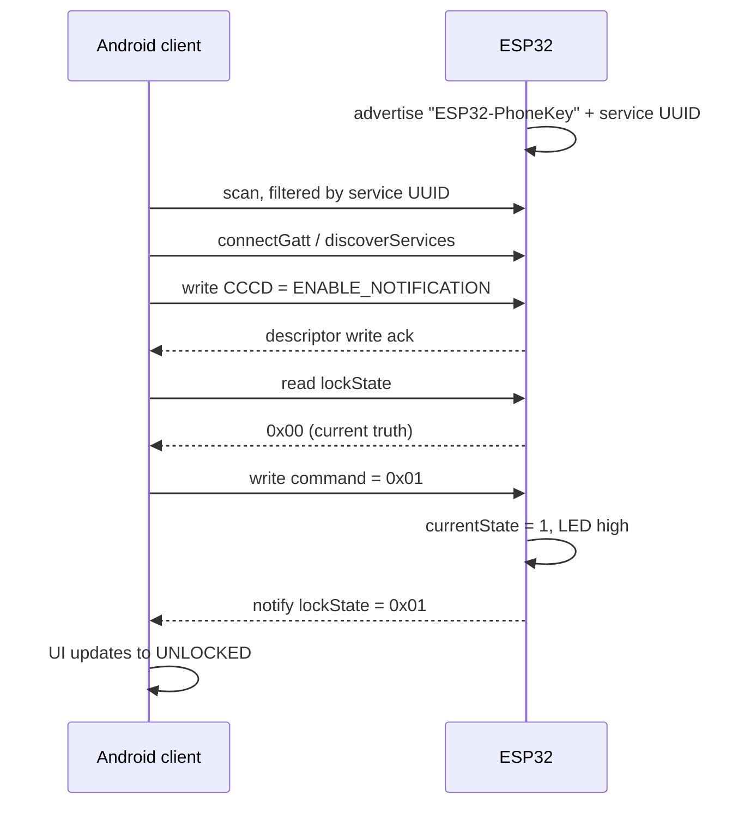

# PhoneKey: an ESP32 BLE phone-as-key

An Android phone unlocks an ESP32 over Bluetooth Low Energy. The ESP32 runs a BLE
GATT server that owns the lock state and drives an LED. The Android client scans
for it, subscribes to state changes, and sends lock/unlock commands. State lives in
exactly one place, the firmware, and the phone is just a view onto it.

This was my first BLE project. The interesting parts are the wire protocol, the
connection lifecycle, and a handful of failure modes that cost me real debugging
time. Those are written up at the bottom.

---

## How the two halves talk

The ESP32 advertises as **`ESP32-PhoneKey`** with the service UUID in the
advertising packet, so Android can filter at the OS level while scanning instead of
connecting to every nearby device to find out what it is.

### GATT table

| | UUID | Properties | Payload |
|---|---|---|---|
| **Service** | `7160168f-2643-437a-a817-1afd55a0e901` | | |
| `lockState` | `7160168f-2643-437a-a817-1afd55a0e902` | READ, NOTIFY | 1 byte |
| `command` | `7160168f-2643-437a-a817-1afd55a0e903` | WRITE | 1 byte |
| CCCD | `00002902-0000-1000-8000-00805f9b34fb` | | subscription descriptor on `lockState` |

### Wire protocol

One byte, both directions:

| Value | Meaning |
|---|---|
| `0x00` | LOCKED (LED off) |
| `0x01` | UNLOCKED (LED on) |

The firmware rejects anything else. A write is ignored if it's zero-length, if the
byte isn't `0` or `1`, or if it matches the current state. A redundant command
therefore produces no notification and no LED flicker.

### Connection sequence



The read is chained off the descriptor-write callback rather than fired
immediately. Android's GATT stack runs one operation at a time, so starting a read
before the CCCD write completes silently drops one of the two.

---

## Design decisions

**Bluedroid rather than NimBLE.** NimBLE has the smaller footprint and is the usual
recommendation for new work. I picked Bluedroid for debuggability, since it has
richer logging and better-documented failure modes. On a first BLE project most of
your time goes into figuring out why something *didn't* connect, and that matters
more than RAM.

**A single byte, not a string or a struct.** The characteristic carries lock state,
not presentation. The firmware owns the state machine, the client owns how that
state is worded and drawn. Changing UI copy never requires reflashing.

**Service UUID in the advertising packet.** This lets Android filter during the
scan at the OS level. Without it the app has to connect to every nearby device just
to identify it, which is slow and hard on battery.

**Confirmed UI, not optimistic UI.** Tapping UNLOCK shows "Unlocking…" and the UI
only commits once the peripheral notifies the new state, with a 3-second timeout
that resets it if no confirmation arrives. Optimistic UI is normally the better
default for perceived responsiveness, but this is a lock. A screen reading
"unlocked" when the hardware didn't act is a safety bug, not a polish issue.

**Notify-on-change plus read-on-connect.** BLE notifications are unacknowledged, so
one sent while the client is mid-connection or briefly out of range is lost with no
retransmission. Reading once on connect closes that gap. Notifications keep the UI
live during a session, and the read guarantees the session starts from truth.

---

## Debugging findings

The things that cost real time and aren't in the documentation.

**ESP32 Arduino core 3.3.10 does not auto-create the CCCD for NOTIFY
characteristics.** The Client Characteristic Configuration Descriptor is what a
central writes to subscribe. Some stacks add it implicitly when a characteristic
declares NOTIFY. This core does not, so it has to be attached explicitly with
`BLE2902`. Without it the characteristic advertises NOTIFY, subscription *appears*
to succeed, and no notification ever arrives. I confirmed this by inspecting the
GATT table in nRF Connect.

**A leading space in a UUID string throws `NumberFormatException`.** Kotlin
`object` initializers run lazily on first use, so the crash surfaces at first access
rather than at startup. That points your debugging at entirely the wrong place.

**Manifest permissions pasted inside `<application>` instead of above it.** Gradle
syncs clean and the build succeeds, but the OS reads the app as declaring no
permissions at all. Every BLE call then fails at runtime with nothing linking the
failure back to the manifest.

**No onboard user LED on this board.** I established this only after sweeping GPIO
pins. The working configuration is GPIO 2 with an external LED and a 180 Ω
resistor.

**The silkscreened `D2` pin is a flash pin.** Jumpering there gives an always-on LED
and interferes with esptool's serial upload path. The silkscreen labels do not map
to the GPIO numbers you use in code.

**The in-app event log became my primary debugging surface.** I built it because
hardware access was limited and there was no practical way to watch serial output
with the tablet in hand. It ended up being how nearly every connection-lifecycle
issue got diagnosed. It holds the last 60 lines: scan results with RSSI, service
and characteristic discovery, CCCD write status, every read and notify, and raw
GATT error codes.

---

## Hardware

| | |
|---|---|
| Board | ESP32 dev board (no onboard user LED) |
| LED | GPIO 2 → 180 Ω resistor → LED → GND |
| Serial | 115200 baud |
| Test phone | Samsung Galaxy Tab A 8.0 (SM-T387W), Android 10, Bluetooth 4.2 |
| USB driver | CP210x Universal Windows Driver, installed manually via Device Manager |

## Toolchain

Arduino / C++, ESP32 Arduino core 3.3.10, Bluedroid. Kotlin, Jetpack Compose,
Material 3. nRF Connect for GATT inspection.

---

## Repository layout

```
firmware/
  ESP32-PhoneKey-GATT/   BLE GATT server, the real firmware
  blink-test/            GPIO 2 bring-up sketch, used to find a working LED pin
android/                 Android Studio project (Kotlin, Compose)
  app/src/main/java/com/example/phonekey/
    MainActivity.kt      Compose UI: readiness checks, controls, event log
    BleManager.kt        scan / connect / subscribe / read / write lifecycle
    BleUuids.kt          the UUID contract, shared with the firmware
```

## Build and run

**Firmware.** Open `firmware/ESP32-PhoneKey-GATT/ESP32-PhoneKey-GATT.ino` in the
Arduino IDE, install the ESP32 board package, select the board, and upload. The
serial monitor at 115200 shows connect, disconnect, and received-byte lines.

**Android.** Open `android/` in Android Studio and run. `local.properties` is
generated on first open. Minimum SDK 26, targeting SDK 36.

The client requests different permissions depending on Android version, because the
rules changed at Android 12. On API 31 and above it asks for `BLUETOOTH_SCAN` and
`BLUETOOTH_CONNECT`. Below that it asks for `ACCESS_FINE_LOCATION`, since BLE
scanning is classified as location access there and also needs location services
switched on. The first screen shows all three readiness checks with a re-check
button, because a denied permission or a disabled radio otherwise looks identical
to "no device found".

## Scope and limitations

This is a learning project, not a security product. The link is unauthenticated and
unencrypted. There's no BLE pairing or bonding, no rolling code, and no proximity
check, so any client that knows the UUIDs can write the command characteristic.
Adding LESC pairing and a challenge-response over the command characteristic is the
natural next step.
